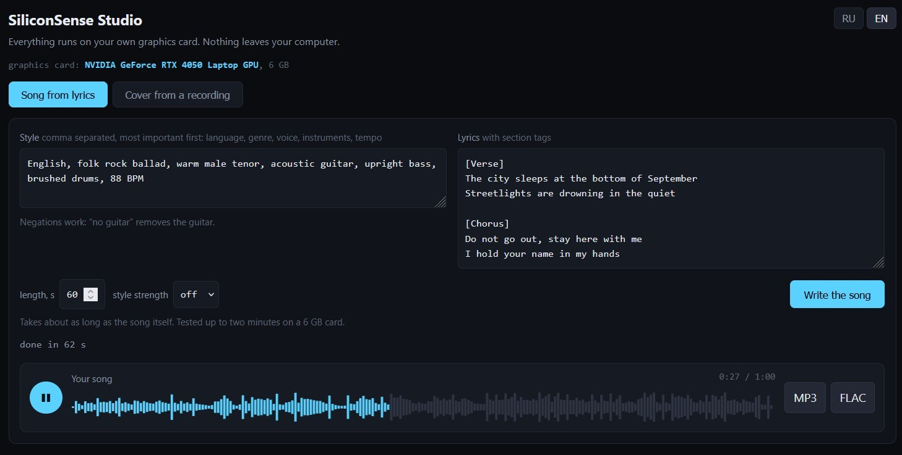
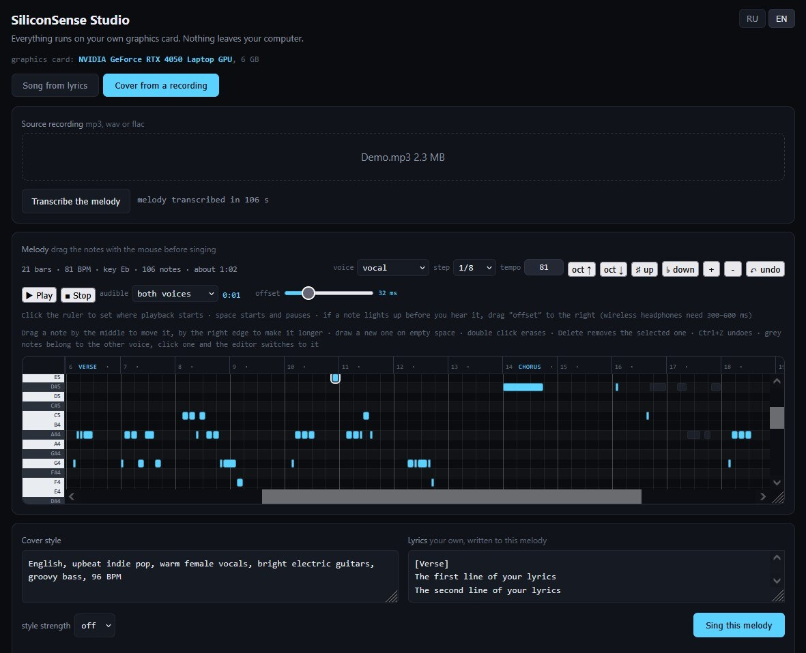

# YuE2 Studio for Windows

Write songs, or sing covers to a melody lifted from your own recording — on your
own graphics card, with nothing leaving your computer. One batch file installs
everything and opens the studio in your browser.

Русская версия: **[README.ru.md](README.ru.md)**

## What you need

- Windows 10 or 11
- An NVIDIA graphics card with **6 GB** or more
- NVIDIA driver **580 or newer** — older drivers work too, but roughly five times slower
- About 25 GB of free disk space
- [git for Windows](https://git-scm.com/download/win)
- An internet connection for the first run: about 7 GB is downloaded

## Getting started

1. [Download the latest release](../../releases/latest) or clone this repository.
2. Unpack it into a folder without spaces in the path, for example `C:\SiliconSense`.
3. Double-click `start.bat`.

The first run installs Python, the engine, the libraries and the models, and takes
a while. Every run after that takes under a minute. The browser opens by itself.
To shut down, close the black console window.

The interface follows your Windows language and has an RU / EN switch in the
top right corner.

## How fast it is

Measured on a laptop **RTX 4050, 6 GB**, driver 581:

| Task | Time |
|---|---|
| 1 minute of music | 61 s |
| 2 minutes of music | 118 s |
| Transcribing a melody from a recording | 106 s |
| Singing 2 minutes to that melody | 130 s |

Roughly real time: a song takes about as long as the song lasts. A stronger card
is faster.

> The driver matters more than it looks. On CUDA 12 the engine turns its fast
> kernels off and the same minute takes **328 s** instead of 61. `start.bat` reads
> your driver version and picks the matching PyTorch build automatically.

## What it does

**Song from lyrics.** You give a style line and the words, you get a recording.

**Cover from a recording.** You give it an audio file; the melody is transcribed
from it into a score, you correct the notes with the mouse in the piano roll, and
the model sings *your* lyrics to that melody.

**What to transcribe.** Next to the transcribe button you choose between *melody only*
and *melody and chords*. In melody mode the model sings your tune and invents its own
accompaniment; in full mode the score also carries the chords, so the cover follows the
original harmony. The singing mode always matches whatever was transcribed.

**Fit the melody to the lyrics.** Optional, and it **changes the melody**: the button
under the piano roll merges surplus notes and splits long ones so their count matches the
syllables. Leave it alone for a cover meant to follow the original — the tune stops being
recognisable. It is there for the other case: your own lyrics whose lines differ a lot in
length from the tune, where fitting the words matters more than keeping the original shape.

The recipe that works for a cover: transcribe *melody and chords*, leave style strength
off, sing.

Generation settings match the official Comfy-Org cover template and are not exposed:
narrowing the sampling produces noise, not a closer cover. Style strength guides style
and lyrics rather than the notes, so leave it off for covers.

The editor is [pianoroll.js](https://github.com/siliconsense/pianoroll.js), our
dependency-free score editor.

## How it works

The batch file sets up an isolated Python environment with [uv](https://github.com/astral-sh/uv),
clones [ComfyUI](https://github.com/comfyanonymous/ComfyUI) as the engine, installs
a PyTorch build matched to your driver, and downloads the models. `server.py` is a
small standard-library server: it runs the engine headless, builds the graphs and
serves our interface. You never see ComfyUI.

ComfyUI is used because it supports this model natively and, unlike the official
package, does not require flash attention — which has no Windows build.

## Licence

The code here is MIT, see [LICENSE](LICENSE).

**The model weights are not in this repository and are not redistributed by us.**
They are downloaded at run time from the authors' own repositories under
CC BY-NC 4.0 — personal use is free, commercial use by a company is arranged with
the authors. Details and credits: **[MODEL-LICENCE.md](MODEL-LICENCE.md)**.

The model is [YuE2](https://huggingface.co/m-a-p/YuE2-3B) by Multimodal Art
Projection and HKGAI. We are grateful to its authors — this tool is only a
wrapper around their work.

## Offline instructions

`README.txt` (English) and `ПРОЧТИ.txt` (Russian) ship with the archive and
contain the same instructions plus a troubleshooting list, for people who already
downloaded it and have no browser tab open.

---

Made by [SiliconSense](https://siliconsense.club).
